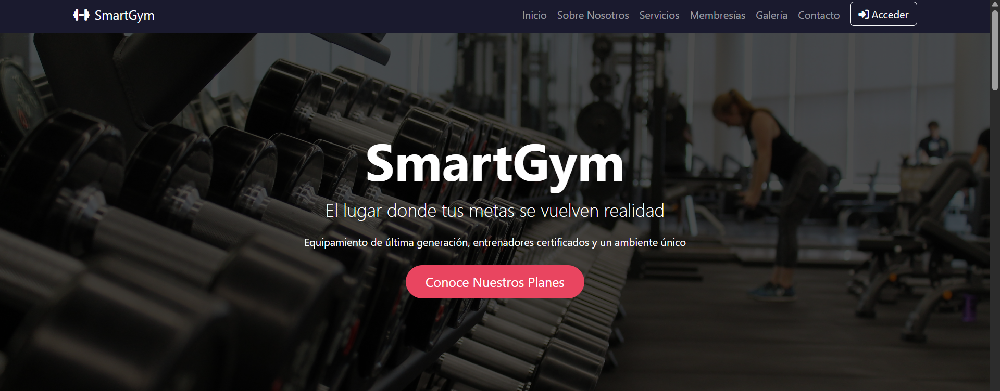
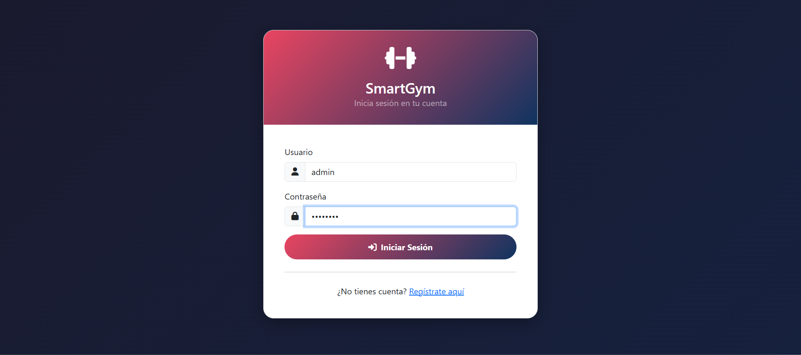
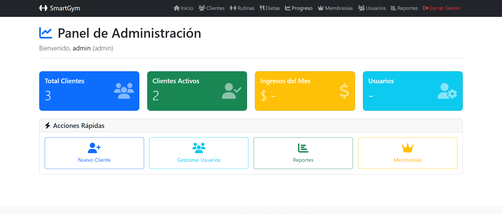
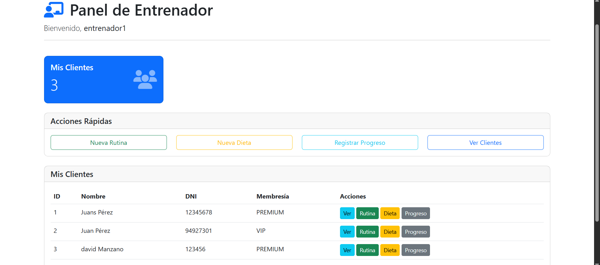
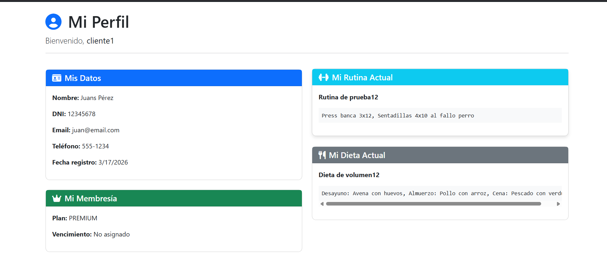


# 🏋️ SmartGym - Sistema de Gestión de Gimnasio

[](https://www.python.org/)
[](https://flask.palletsprojects.com/)
[](https://www.microsoft.com/sql-server)
[](https://www.docker.com/)

Sistema completo de gestión para gimnasios con **arquitectura hexagonal**, roles de usuario (Admin/Entrenador/Cliente), CRUD completo de clientes, membresías, pagos, rutinas, dietas y seguimiento de progreso.

---

## 📋 Características

- ✅ **Arquitectura Hexagonal** (Puertos y Adaptadores)
- ✅ **Autenticación y Roles**: Admin, Entrenador, Cliente
- ✅ **CRUD Completo**: Clientes, Membresías, Pagos, Rutinas, Dietas, Progreso
- ✅ **API REST**: 40+ endpoints organizados por módulos
- ✅ **Frontend**: Bootstrap 5, responsive
- ✅ **Docker**: Contenedor para fácil despliegue

---

## 🧠 Arquitectura Hexagonal

El sistema está organizado bajo el patrón de **puertos y adaptadores**, separando claramente las responsabilidades:

- **Domain**: contiene la lógica de negocio pura (entidades y reglas)
- **Application**: casos de uso que coordinan la lógica
- **Infrastructure**: implementación de base de datos y capa web (Flask)

Esta arquitectura permite desacoplar la lógica del framework y de la base de datos, facilitando el mantenimiento, las pruebas y la escalabilidad del sistema.

---

## 🏗️ Tecnologías

| Capa | Tecnología |
|------|------------|
| Backend | Python 3.12 + Flask |
| Base de datos | SQL Server 2022 |
| ORM | SQLAlchemy |
| Frontend | Bootstrap 5, Jinja2, JavaScript |
| Infraestructura | Docker |

---

## 👥 Roles y Permisos

| Rol | Acceso |
|-----|--------|
| 👑 **Admin** | Acceso total a todo el sistema |
| 🏋️ **Entrenador** | Gestiona clientes, rutinas, dietas, progreso |
| 👤 **Cliente** | Solo visualiza su información personal |

---

## 👤 Usuarios de Prueba

| Usuario | Contraseña | Rol |
|---------|------------|-----|
| `admin` | `admin123` | Administrador |
| `entrenador1` | `admin123` | Entrenador |
| `cliente1` | `admin123` | Cliente |

> ⚠️ Estas credenciales son únicamente para pruebas en entorno local.

---

## 🚀 Cómo Probar el Proyecto 

### Opción 1: Ejecutar con Docker (Recomendado)

#### Requisitos previos
- Docker Desktop instalado
- Git (opcional)

#### Pasos

```bash
# 1. Clonar repositorio
git clone https://github.com/mhdavid405-cell/smartgym-hexagonal.git
cd smartgym-hexagonal

# 2. Levantar el proyecto
docker-compose up -d

# 3. Abrir en navegador
http://localhost:5000
Comandos útiles
# Ver logs
docker-compose logs -f web

# Detener
docker-compose down

# Reiniciar
docker-compose restart
Opción 2: Ejecutar sin Docker
# 1. Clonar repositorio
git clone https://github.com/mhdavid405-cell/smartgym-hexagonal.git
cd smartgym-hexagonal

# 2. Crear entorno virtual
python -m venv venv

# Windows
venv\Scripts\activate

# Linux/Mac
source venv/bin/activate

# 3. Instalar dependencias
pip install -r requirements.txt

# 4. Configurar variables de entorno
# Copiar .env.example a .env y configurar credenciales

# 5. Ejecutar app
python main.py

# 6. Abrir navegador
http://localhost:5000
🔐 Variables de Entorno

El proyecto utiliza variables de entorno para manejar la configuración de forma segura.

# Ejemplo de configuración (.env)
DB_HOST=localhost
DB_NAME=smartgym
DB_USER=root
DB_PASSWORD=your_password_here
🔗 Endpoints API
Método	Endpoint	Descripción
GET	/api/clientes	Listar clientes
POST	/api/clientes	Crear cliente
GET	/api/clientes/<id>	Obtener cliente
PUT	/api/clientes/<id>	Actualizar cliente
DELETE	/api/clientes/<id>	Eliminar cliente
GET	/api/membresias	Listar membresías
POST	/api/pagos	Registrar pago
GET	/api/rutinas	Listar rutinas
GET	/api/dietas	Listar dietas
GET	/api/progreso	Listar progreso
POST	/api/auth/login	Iniciar sesión
📁 Estructura del Proyecto
smartgym-hexagonal/
├── src/
│   ├── domain/           # Lógica de negocio
│   ├── infrastructure/   # Adaptadores (DB, Web)
│   └── config/           # Configuración
├── tests/                # Pruebas
├── main.py               # Punto de entrada
├── Dockerfile
├── docker-compose.yml
└── requirements.txt


## 📸 Capturas de Pantalla

| Página | Captura |
|--------|---------|
| Página Principal | ! |
| Login |  |
| Dashboard Admin |  |
| Dashboard Entrenador |  |
| Dashboard Cliente |  |


📄 Licencia
MIT

👨‍💻 Autor

Manzano Hernandez David Axel
📧 mhdavid405@gmail.com


⭐️ ¡No olvides dejar una estrella si te gustó el proyecto!

